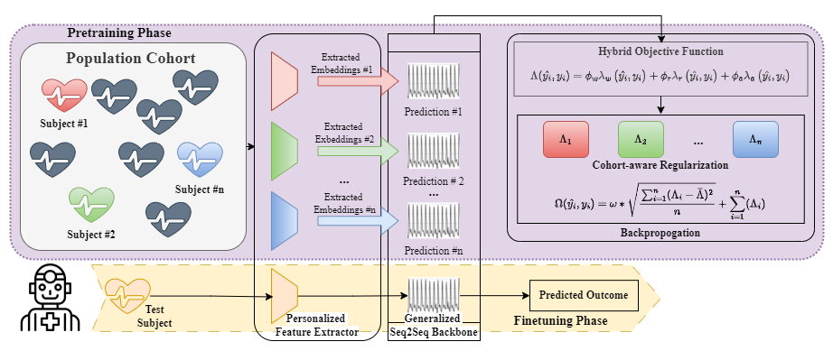

_This branch pertains to the implementation of an extension manuscript that is currently under review. For the implementation of the accepted version, please refer to the `main` branch._

# ArterialNet (2024)
This is the code Implementation for our submitted manuscript: `ArterialNet: Reconstructing Arterial Blood Pressure Waveform with Wearable Pulsatile Signals, a Cohort-Aware Approach`.

[arxiv link](https://arxiv.org/pdf/2410.18895?) to arxiv.

Corresponding Author: [Sicong Huang](mailto:siconghuang@tamu.edu).

## Description

ArterialNet is a pre-training framework that can be paired with any deep learning sequence-to-sequence model for arterial blood pressure (ABP) reconstruction. Here we demonstrate the effectiveness of ArterialNet by pairing it with two different backbone architectures: U-Net and Transformer. We evaluated ArterialNet on the MIMIC III Waveform Dataset and showed improved performance on both U-Net and Transformer backbones. Please refer to our arxiv [paper](https://arxiv.org/pdf/2410.18895?) for full details. 

## __What's New__
In our previous BHI'23 version, we proposed a method to reconstruct ABP waveforms, deriving precise SBP & DBP estimations using PPG or Bio-Z signals. We validated its accuracy in both in-clinic (MIMIC-III) and remote health (CTRAL BioZ) settings.
In this extension, we have made the following improvements:
Method Enhancements:
- Enabled the model to compute and incorporate pulse transit time (PTT) features and tabular morphological/human-extracted features with early fusion.
- Extended the hybrid objective function by incorporating losses from waveform reconstruction (waveform + statistical loss), correlation (normalized Pearson's R loss), and alignment (DTW-loss).
Ablation Study:
- Investigated the contributions of each component in ArterialNet via ablation studies.
Robustness Analysis:
- Discussed ArterialNet’s translational impact and robustness to data augmentations (masked pulse or reflected wave, masked BP ranges, Gaussian noise, recalibration).

## Prerequisites

### Setup Environment
Our experiments are conducted on a Linux-based machine with the following specifications:

* Linux-based OS 
* Python 3.9.15
* conda 4.14.0
* PyTorch 1.11.0
* git 2.25.1
* CUDA 11.4 or 11.6 (for GPU acceleration)

We highly recommend you to use the conda environment (`arterialnet.yml`) we shared to avoid potential compatibility issues. To set up Conda for your computer, you can follow the official instructions [here](https://conda.io/projects/conda/en/latest/user-guide/install/index.html).

Command Line Input Steps: 

1. `git pull https://github.com/stmilab/ArterialNet.git` clones the repository to your local machine

2. `cd ArterialNet/` changes the directory to the repository

3. `conda env create -f arterialnet.yml` creates a new conda environment the same as ours (`arterialnet.yml` contains the packages used for our experiments.)

4. `conda activate arterialnet` activates the created conda environment you just created

## Implementations
ArterialNet has 3 major components:
* Feature Extractor and backbone
* Hybrid Loss Function
* Subject-Invariant Regularization

### ArterialNet Framework

* `models/arterialnet.py` contains the Feature Extractor and Backbone of our proposed ArterialNet framework along with the U-Net and Transformer backbone architectures.
    * U-Net implementation is modified from [Seq-U-Net](https://github.com/f90/Seq-U-Net) in Pytorch
    
    * Transformer implementation is based on [PyTorch Transformer](https://pytorch.org/docs/stable/generated/torch.nn.Transformer.html)
* Hybrid Loss Function is implemented in a custom [`train_epoch()`](https://github.com/stmilab/ArterialNet/blob/main/run_torch_sequnet.py#L55) function in `run_torch_sequnet.py` and `run_torch_transformer.py`

* Subject-Invariant Regularization is implemented in a custom [`rex_preprocess()`](https://github.com/stmilab/ArterialNet/blob/main/utils/rex_utils.py#L18) in `utils/rex_utils.py` and modified from [REx](https://github.com/capybaralet/REx_code_release)

### Training and Testing (__updated__)
_We integrated both backbones into one script to minimize redundancy._
* `python run_torch_arterialnet_rex.py` runs the ArterialNet with your backbone model 
* `python run_torch_sequnet.py` is the base version without subject-invariant regularization 

#### Example: ArterialNet + Transformer
`run_torch_arterialnet_rex.py --seq2seq_backbone transformer` is the implementation of ArterialNet with transformer as the backbone for reconstructing ABP

### Ablation (__new__)
_We have included implementations for the following ablations to evaluate robustness_
[
    `shrink_data_size`,
    `hide_bp_range`,
    `domain_segmentor`,
    `gaussian_noise`,
    `mask_first_half`,
    `mask_last_half`,
    `mask_current_beat`,
    `mask_prev_beat`,
    `calibration_time`,
]
#### Example: ArterialNet + Transformer + ablation on gaussian noise

* `python run_torch_arterialnet_rex.py --seq2seq_backbone transformer --ablation_type gaussian_noise --gaussian_noise_rate 0.5` runs the ArterialNet with transformer as the backbone for reconstructing ABP with ablation study enabled

### Hyperparameter Tuning

Hyperparameter Tuning scope for MIMIC is here: [`mimic_hyperparam.txt`](exp_setup/mimic_hyperparam.txt)

Hyperparameter Tuning scope for BioZ is here: [`bioz_hyperparam.txt`](exp_setup/bioz_hyperparam.txt)
## Datasets

### MIMIC III Waveform Dataset

* You can request and download the MIMIC-III ICU Waveform from [here](https://physionet.org/content/mimiciii/1.4/).

* Select your cohort of patients and download. For example:  [`mimic_file_list.txt`](utils/mimic_file_list.txt)

* Specify argument `--data_path` with your data path, otherwise change the default value in [`arg_parser.py`](https://github.com/stmilab/ArterialNet/blob/main/utils/arg_parser.py#L59)

### Bio-Impedance Experiments 

Please refer to this [paper](https://ieeexplore.ieee.org/document/8863984). 

## Evaluation

`utils/visual_combine.py` has the following evaluation metrics implemented and ready to be used:

* ABP Waveform: 
    * Root Mean Squared Error (RMSE)
    * Mean Absolute Error (MAE)
    * Pearson's Correlation Coefficient (R)
    * Waveform Reconstruction vs. Reference Plot
* SBP/DBP (all of the above plus):
    * Bland-Altman Plots
    * Confusion Matrix of hypertension stages 
    * SBP/DBP Prediction vs. Reference Plots
